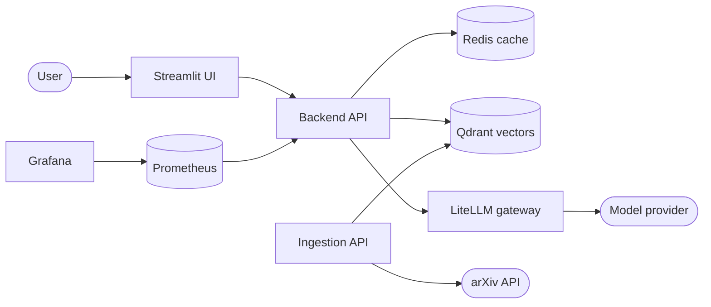

# Agentic Paper Explorer

An end-to-end agentic RAG system that turns a plain-language question into a cited answer grounded
in real arXiv papers.

Ask *"What is attention in neural networks?"* and the system retrieves the most relevant paper
excerpts from a vector store, generates an answer where every claim carries a citation marker, and
returns the source links so the answer can be checked rather than trusted.

## Why this project exists

Reading research is slow, and general-purpose chatbots answer confidently from memory with no
traceable source. This project addresses three specific problems:

| Problem | How it is solved |
| --- | --- |
| Answers you cannot verify | Every claim cites a retrieved excerpt, and source URLs are returned separately |
| Hallucination when evidence is missing | Generation abstains before calling the model when retrieval returns nothing usable |
| Silent production failures | A broken model gateway returns `HTTP 502` with a `degraded` flag instead of a friendly-looking fake answer |

It also serves as a reference implementation of a production-shaped RAG service: typed contracts,
injected dependencies, containerised services with health checks, Prometheus metrics, and a
provisioned Grafana dashboard.

## Features

- **Batched arXiv ingestion** with rate limiting, retries, and safe XML parsing
- **Chunking and embedding** into Qdrant with deterministic, idempotent point IDs
- **Cache-first retrieval** - Redis lookup, then semantic search over embedded chunks
- **Grounded generation** through a LiteLLM gateway with a citation-aware prompt contract
- **Streaming answers** over Server-Sent Events, with a complete-JSON fallback endpoint
- **Explicit failure semantics** - stable error categories, retries with backoff, degraded responses
- **Streamlit UI** with streaming output, source links, and helpful/not-helpful feedback
- **Observability** - Prometheus metrics and a provisioned Grafana RAG overview dashboard

## Architecture



Full diagrams, component boundaries, and design trade-offs are in
[docs/architecture.md](docs/architecture.md).

## Tech stack

| Layer | Technology |
| --- | --- |
| Language | Python 3.12+ |
| API | FastAPI, Uvicorn, Pydantic |
| UI | Streamlit |
| Vector store | Qdrant |
| Cache | Redis |
| Embeddings | Hugging Face via `langchain-huggingface` and `sentence-transformers` |
| Model gateway | LiteLLM |
| Data source | arXiv Atom API, parsed with `defusedxml` |
| Observability | Prometheus, Grafana, `prometheus-fastapi-instrumentator` |
| Testing | pytest, pytest-cov, pytest-randomly, pytest-xdist |
| Quality and security | ruff, bandit, radon, pre-commit |
| Packaging | uv, setuptools |
| Containers | Docker, Docker Compose |

## Project structure

```text
agentic-paper-explorer/
├── docs/                          # In-depth documentation and diagrams
│   ├── architecture.md
│   ├── infrastructure.md
│   ├── images/
│   └── phases/                    # Phase-by-phase engineering record
├── src/agentic_paper_explorer/
│   ├── backend/
│   │   ├── api/                   # Routers and Pydantic contracts
│   │   ├── database/              # Qdrant and Redis clients
│   │   ├── generation/            # Provider, prompts, generation service
│   │   ├── retrieval/             # Cache-first retrieval service
│   │   └── security/
│   ├── ingestion/
│   │   ├── api/                   # Ingestion routers and contracts
│   │   ├── data_ingestion/        # arXiv client and batch reader
│   │   ├── processing/            # Chunking and embeddings
│   │   └── pipeline.py            # Pipeline runner and CLI
│   ├── frontend/                  # Streamlit app and HTTP client
│   ├── monitoring/                # Metrics, feedback, Prometheus/Grafana config
│   ├── evaluation/                # Evaluation harness
│   ├── configs/                   # Environment-driven settings
│   └── utils/
├── tests/                         # Mirrors the source tree
├── docker-compose.yml
├── Dockerfile
├── Makefile
└── pyproject.toml
```

## Getting started

### Prerequisites

- Python 3.12+
- [uv](https://github.com/astral-sh/uv)
- Docker and Docker Compose
- An API key for the model provider routed through LiteLLM

### 1. Clone and configure

```bash
git clone https://github.com/thobs-10/agentic-paper-explorer.git
cd agentic-paper-explorer
cp .env.example .env   # then set OPENROUTER_API_KEY
```

Never commit `.env`. All configuration is environment-driven; no secrets belong in source.

### 2. Run the whole stack with Docker

```bash
make up      # docker compose up -d
make ps      # every service should report (healthy)
```

| Service | URL |
| --- | --- |
| Streamlit UI | `http://localhost:8501` |
| Backend API docs | `http://localhost:8000/docs` |
| Ingestion API docs | `http://localhost:8001/docs` |
| Grafana | `http://localhost:3000` |
| Prometheus | `http://localhost:9090` |

### 3. Populate the corpus

The backend answers from whatever is already in Qdrant, so ingest some papers first:

```bash
curl -X POST "http://localhost:8001/api/v1/ingestion/papers/process" \
  -H "Content-Type: application/json" \
  -d '{"search_query":"all:transformer","max_results":10}'
```

### 4. Ask a question

```bash
curl -s -X POST http://localhost:8000/api/v1/generation/answer \
  -H 'Content-Type: application/json' \
  -d '{"query":"What are transformer models used for in NLP?"}' | python3 -m json.tool
```

Or open the UI at `http://localhost:8501`.

### Running locally without containers

```bash
uv sync                 # install dependencies including the dev group
make infra-up           # qdrant, redis, litellm only
make api                # backend on :8000
make ingest             # ingestion on :8001
make ui                 # streamlit on :8501
```

## Development

```bash
uv run pytest tests -q            # full test suite
uv run ruff check src tests       # lint
uv run ruff format src tests      # format
uv run bandit -r src              # security scan
uv run pre-commit run --all-files # everything the hooks enforce
```

Tests mirror the source tree, mock every external API and model provider, and stay deterministic and
isolated. Source changes under `src/agentic_paper_explorer` ship with matching test changes.

## API reference

| Method | Path | Purpose |
| --- | --- | --- |
| `POST` | `/api/v1/generation/answer` | Grounded answer as complete JSON |
| `POST` | `/api/v1/generation/answer/stream` | Same answer streamed over SSE |
| `POST` | `/api/v1/feedback` | Record a helpful / not-helpful rating |
| `GET` | `/metrics` | Prometheus exposition |
| `GET` | `/health` | Liveness |
| `GET` | `/api/v1/ingestion/papers/search` | Batched arXiv read-through |
| `POST` | `/api/v1/ingestion/papers/process` | Ingest, chunk, embed, and store papers |

## Documentation

| Document | Contents |
| --- | --- |
| [docs/architecture.md](docs/architecture.md) | Diagrams, component boundaries, design decisions |
| [docs/infrastructure.md](docs/infrastructure.md) | Service topology, ports, volumes, make targets |
| [docs/phases](docs/phases) | Detailed engineering record for every delivery phase |
| [project.md](project.md) | Specification, goals, and delivery roadmap |

## Roadmap

Delivered: datastores and the arXiv API, the ingestion pipeline, retrieval, grounded and streaming
generation, the Streamlit UI, containerization, and monitoring with user feedback.

Open:

- hybrid retrieval with lexical matching and reranking
- answer-level caching
- persisted feedback for qualitative review
- RAGAS-based evaluation harness
- alerting rules and distributed tracing
- CI/CD pipeline publishing images to Docker Hub

## Author

**Thobela Sixpence** — [github.com/thobs-10](https://github.com/thobs-10)

## License

Released under the terms in [LICENSE](LICENSE).
