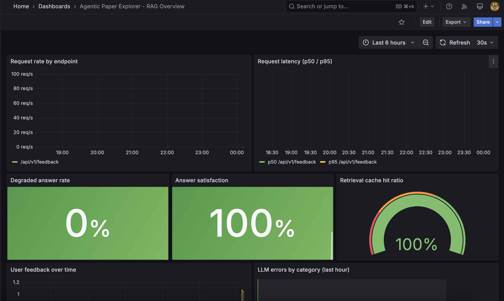

# Documentation

In-depth documentation for Agentic Paper Explorer. The root [README.md](../README.md) is the short
overview; everything here is the detailed engineering record.

## Contents

| Document | What it covers |
| --- | --- |
| [architecture.md](architecture.md) | System, request, ingestion, and deployment diagrams |
| [infrastructure.md](infrastructure.md) | Local service topology, ports, volumes, make targets |
| [phases/phase-0-datastores-and-arxiv-api.md](phases/phase-0-datastores-and-arxiv-api.md) | Datastores and the batched arXiv read API |
| [phases/phase-1-ingestion-pipeline.md](phases/phase-1-ingestion-pipeline.md) | Chunking, embedding, and Qdrant upserts |
| [phases/phase-2-retrieval.md](phases/phase-2-retrieval.md) | Cache-first retrieval and context assembly |
| [phases/phase-3-generation.md](phases/phase-3-generation.md) | Grounded generation, citations, streaming |
| [phases/phase-4-streamlit-ui.md](phases/phase-4-streamlit-ui.md) | Streamlit frontend |
| [phases/phase-5-containerization.md](phases/phase-5-containerization.md) | Images, compose topology, end-to-end validation |
| [phases/phase-6-monitoring.md](phases/phase-6-monitoring.md) | Metrics, feedback, Grafana dashboard |

## Assets

Screenshots and exported diagrams live in [images](images). Reference them from any document with a
relative path, for example:

```markdown

```
