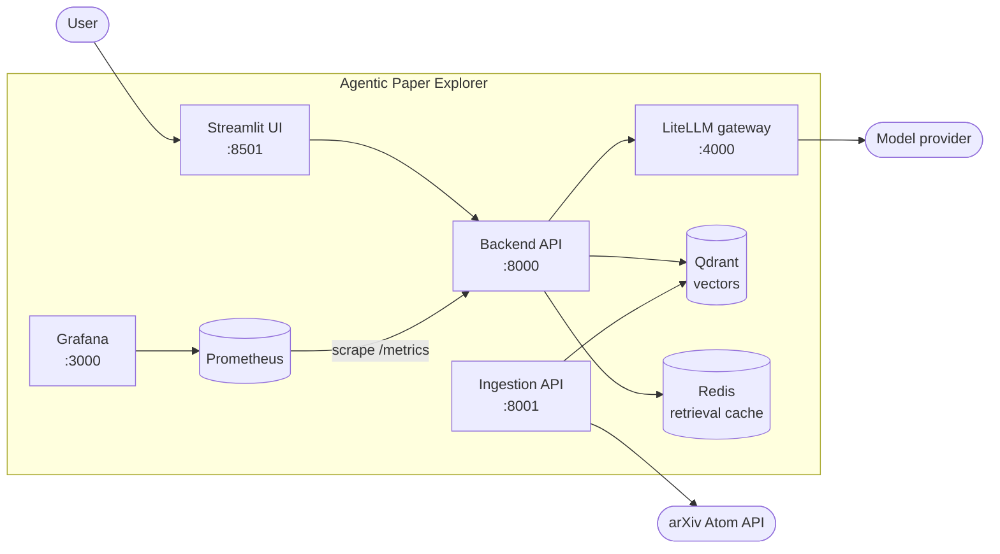
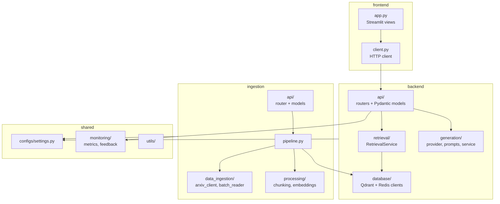
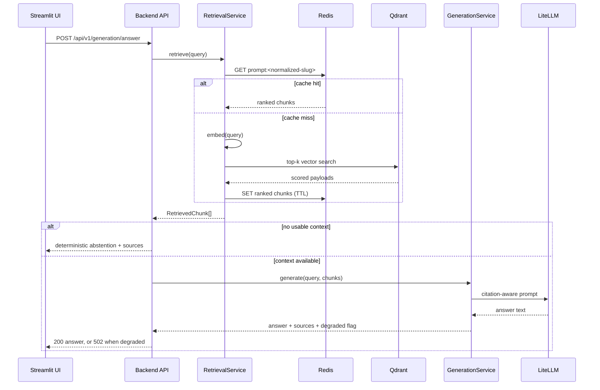
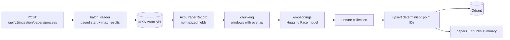
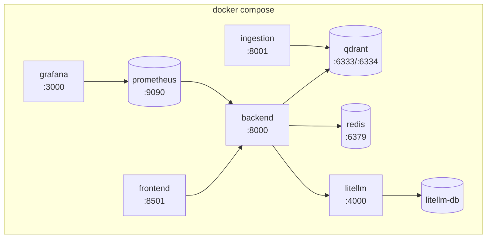

# Architecture

Agentic Paper Explorer is a retrieval-augmented generation (RAG) system over arXiv papers. It is
split into two independent write and read paths:

- **Ingestion (write path)** - fetch arXiv metadata, chunk it, embed it, store vectors in Qdrant.
- **Query (read path)** - embed a user prompt, retrieve ranked chunks, generate a cited answer.

The two paths share only the vector store, so ingestion can run, fail, or scale without affecting
the query API.

> Diagram images exported from these definitions can be placed in [images](images) and embedded
> alongside the Mermaid source.

## System context

## Component layout

Every module under `src/agentic_paper_explorer` owns one concern, and framework glue stays out of
the business logic.

Design rules the layout enforces:

- Route handlers stay thin. They parse the contract, call a service, and map the result.
- Services take their collaborators by injection, so tests never patch module globals.
- Only `monitoring/metrics.py` imports `prometheus_client`; services stay free of telemetry deps.
- Only `generation/provider.py` talks to LiteLLM, so provider quirks stay in one file.

## Query request flow

Failure semantics worth remembering:

- **Abstention is not failure.** Missing evidence returns `HTTP 200` with the abstention message.
- **A broken provider is failure.** It returns `HTTP 502` with `degraded: true` and an
  `error_category`, while still returning retrieved sources.

## Ingestion flow

Deterministic point IDs make repeated ingests idempotent, so re-running a query updates existing
points instead of duplicating the corpus.

## Deployment topology

All services declare health checks and depend on each other with `condition: service_healthy`, so
the backend never starts before Qdrant, Redis, and the gateway accept connections. State lives in
named volumes: `qdrant_data`, `redis_data`, `litellm_pg_data`, `hf_cache`, `prometheus_data`, and
`grafana_data`.

## Cross-cutting decisions

| Decision | Rationale |
| --- | --- |
| Cache-first retrieval | Redis removes repeated embedding and vector-search cost for hot prompts |
| Citation-aware prompting | Every claim is traceable to a retrieved excerpt marker |
| Explicit degraded contract | A gateway outage must not look like a normal answer |
| Metrics only, no tracing backend | Fewer moving parts for signals nothing yet consumes |
| Per-service dependency extras | Frontend images do not carry the embedding or vector stack |
| Environment-driven configuration | No hardcoded secrets or environment-specific endpoints |
