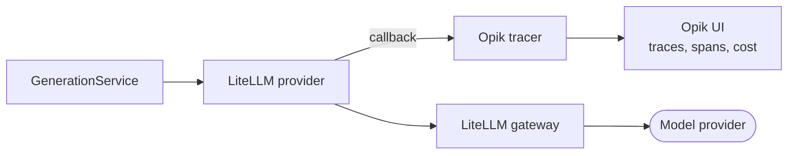

# Phase 10 - Agentic tracing and LLM observability (planned, priority 4)

[Phase 6](phase-6-monitoring.md) deliberately stopped at Prometheus/Grafana metrics and left
distributed tracing as a later decision. This phase makes that decision: add LLM-call-level tracing
without taking on OpenTelemetry's collector/exporter setup, which the project explicitly avoided
before because "nothing yet consumes" that signal.

## Why priority 4

Tracing depends on there being real orchestrated/guarded traffic worth tracing - it comes after
guardrails (Phase 8, so blocked/flagged requests are visible in traces) and after orchestration
(Phase 9, so ingestion runs can be traced too), and before evaluation (Phase 11, which uses traced
runs as its evaluation dataset).

## Tool choice

**Opik** (open source, Apache-2.0, self-hostable via Docker Compose) over LangSmith and over rolling
raw OpenTelemetry.

| Option | Trade-off for this project |
| --- | --- |
| **Opik** (chosen) | Fully open source and self-hostable, has a first-class LiteLLM integration (`opik.integrations.litellm`) that auto-traces gateway calls with a callback, and ships its own UI - no need to build Grafana panels for trace exploration. |
| LangSmith | Not open source; hosted-only with a paid tier past free-tier limits. Rejected on the project's explicit "must be open source" requirement. |
| Langfuse | Also open source and self-hostable, and already informally noted as a baseline in `AGENTS.md`. A reasonable alternative to Opik; either integrates the same way through a LiteLLM callback. Opik is picked here for the LiteLLM-native callback and lighter self-hosted footprint, but this is a low-regret choice either way. |
| Raw OpenTelemetry + collector | Requires standing up and operating a collector, an exporter, and a trace backend (Tempo/Jaeger) on top of what already exists - the highest integration cost, matching the exact concern the project already raised. |

## What to build

| Concern | Location |
| --- | --- |
| Opik self-hosted service | `docker-compose.yml` - add `opik` service(s) per Opik's Docker Compose recipe |
| Tracing hook into LiteLLM calls | `src/agentic_paper_explorer/backend/generation/provider.py` - register Opik's LiteLLM callback where the LiteLLM client is constructed |
| Settings | `configs/settings.py` - `OPIK_API_URL`, `OPIK_PROJECT_NAME`, env-driven, disabled by default in tests |
| Tests | `tests/backend/generation/test_provider.py` - assert the callback is registered only when tracing is enabled, without making real network calls |

## Integration shape

## Concrete steps

1. Add `opik` to the `backend` optional-dependency group.
2. In `provider.py`, register Opik's LiteLLM callback conditionally on a settings flag
   (`tracing_enabled`), so tests and CI never attempt to reach an Opik instance.
3. Add the `opik` service to `docker-compose.yml`, gated behind a compose profile (for example
   `--profile tracing`) so the default `make up` does not force everyone to run an extra service
   locally.
4. Confirm traces show query, retrieved context, prompt, model response, latency, and token cost per
   call - this becomes the evaluation dataset source for Phase 11.
5. Leave OpenTelemetry/Tempo as a documented future option in `docs/architecture.md`'s decisions
   table, not as work for this phase.
