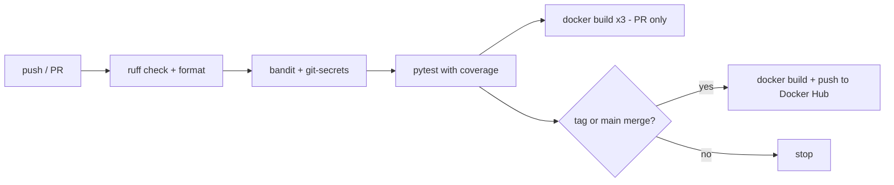

# Phase 7 - CI/CD and Docker Hub publishing (planned, priority 1)

This is the first of the remaining phases because every later phase (guardrails, orchestration,
tracing, evaluation) needs a pipeline that already runs tests, lint, and security scans on every
change. Without it, regressions in those areas would only surface in production.

## Why this is priority 1

- `ruff`, `bandit`, `pytest`, and `pre-commit` already exist locally (see
  [pyproject.toml](../../pyproject.toml)) but nothing enforces them on push or pull request today.
- The project ships three runnable images (`backend`, `ingestion`, `frontend`) built from one
  [Dockerfile](../../Dockerfile) with per-service targets, but they are only ever built locally.
- `project.md` already commits to "CI/CD pipelines... to Dockerhub" - this phase is that commitment
  turned into a concrete workflow.

## What to build

| Concern | Location | Notes |
| --- | --- | --- |
| CI workflow | `.github/workflows/ci.yml` | Runs on push and PR: `uv sync`, `ruff check`, `ruff format --check`, `bandit -r src`, `pytest` |
| Container build check | same workflow, separate job | `docker build` for each target (`backend`, `ingestion`, `frontend`) on every PR, no push |
| Release workflow | `.github/workflows/release.yml` | On tag push (`v*`) or merge to `main`: build all three images, push to Docker Hub with `latest` and the git SHA/tag |
| Secret scanning | CI job using `git-secrets` (already a preferred tool) | Fails the build if a secret pattern is committed |
| Test enforcement | reuse `scripts/check_tests.py` (already referenced in repo instructions) | Fails CI if a source change under `src/` has no matching test change |

## Tool choice

**GitHub Actions + Docker Hub**, both already decided in `project.md`. No alternative evaluation
needed here - the repository is already on GitHub, and Docker Hub is free for public images and has
no separate account/infra to stand up.

## Workflow shape

## Concrete steps

1. Add `.github/workflows/ci.yml` with a single job matrix or sequential steps: setup Python 3.12,
   install `uv`, `uv sync --group dev`, then `ruff check`, `ruff format --check src tests`,
   `bandit -r src`, `pytest -q`.
2. Add a `docker build` step per target using `docker/build-push-action` with `push: false` on PRs.
3. Add `.github/workflows/release.yml` triggered on `push: tags: ["v*"]`, using
   `docker/login-action` with `DOCKERHUB_USERNAME` / `DOCKERHUB_TOKEN` repo secrets, then
   `docker/build-push-action` with `push: true` for each of the three targets, tagged
   `<dockerhub-user>/agentic-paper-explorer-<service>:<tag>` and `:latest`.
4. Add branch protection requiring the CI workflow to pass before merge (repo setting, not a file
   change).
5. Update [README.md](../../README.md) roadmap and [project.md](../../project.md) once the workflow
   is merged and a first image has been published.

## Security notes

- Docker Hub credentials go in GitHub Actions repository secrets, never in the workflow file or
  `.env`.
- Use a Docker Hub **access token** scoped to this repository, not the account password.
- Keep `bandit` and `git-secrets` in the required-checks list so a failing scan blocks the merge,
  not just a warning in the log.
