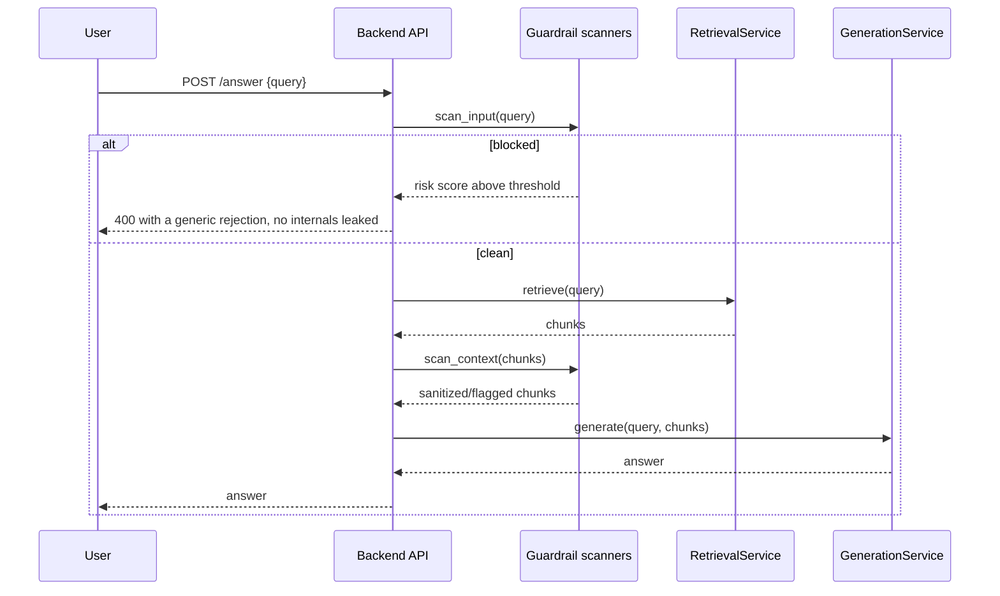

# Phase 8 - LLM security guardrails (planned, priority 2)

`project.md` lists "Security AI guardrails: TBC". This phase resolves that TBC with a lightweight,
open-source choice that fits the existing LiteLLM-gateway architecture without adding a new service
to operate.

## Why priority 2

CI/CD (Phase 7) has to land first so guardrail code ships through the same lint/test/security gates
as everything else. Guardrails come before orchestration and tracing because the system is already
public-facing (Streamlit UI + FastAPI) and currently has no defense against prompt injection,
jailbreak attempts, or PII leaking into logs and cached prompts.

## Threat model (what this phase actually protects against)

| Risk | Where it enters the system today |
| --- | --- |
| Prompt injection / jailbreak via user query | `POST /api/v1/generation/answer` and `/stream` |
| Prompt injection via retrieved paper content (indirect injection) | Chunks pulled from Qdrant into the generation prompt |
| PII or secrets echoed into Redis cache or logs | `RetrievalService` cache keys/values, application logs |
| Unbounded / abusive input | No length or rate limiting on the generation endpoints today |

## Tool choice

**LLM Guard** (open source, MIT-licensed, `pip install llm-guard`) as input/output scanners, invoked
as plain Python functions inside the existing FastAPI handlers - no extra service, no extra
container.

Considered and rejected for this phase:

| Option | Why not now |
| --- | --- |
| NeMo Guardrails | Heavier: requires its own Colang config language and a runtime; overkill for one query/answer endpoint |
| Guardrails AI (`guardrails-ai`) | Strong for structured output validation, but the project's output is already a typed Pydantic contract; adds a second validation layer for little gain |
| Rolling a custom regex/keyword filter | Fastest to write, weakest coverage (no jailbreak pattern library, no PII detection) |

LLM Guard wins on the project's own criteria: open source, a small pure-Python dependency, and
scanners (`PromptInjection`, `Anonymize`/PII, `TokenLimit`, `Toxicity`) that map directly onto the
threat model above.

## What to build

| Concern | Location |
| --- | --- |
| Guardrail scanning functions | `src/agentic_paper_explorer/backend/security/guardrails.py` (new) |
| Wire into the generation router | `src/agentic_paper_explorer/backend/api/router.py` - scan the incoming query before retrieval, scan retrieved chunk text before it enters the prompt |
| Config (enabled scanners, thresholds) | `src/agentic_paper_explorer/configs/settings.py` - new `GuardrailSettings`, env-driven |
| Metrics | extend `monitoring/metrics.py` with a `rag_guardrail_blocks_total{scanner, stage}` counter, following the existing pattern |
| Tests | `tests/backend/security/test_guardrails.py` (new), mirroring the existing test layout |

## Request flow with guardrails

## Concrete steps

1. Add `llm-guard` to the `backend` optional-dependency group in `pyproject.toml`.
2. Implement `scan_input(query: str) -> ScanResult` using LLM Guard's `PromptInjection` and
   `TokenLimit` scanners, returning a typed result the router can branch on.
3. Implement `scan_context(chunks: list[RetrievedChunk]) -> list[RetrievedChunk]` to catch indirect
   injection from paper abstracts before they reach the LLM prompt.
4. Reject blocked requests with `HTTP 400` and a generic message; log the scanner name and score,
   never the raw flagged text, to avoid persisting the injected payload.
5. Add rate limiting only if abuse is observed in practice - `project.md` already says not to add
   gateways/rate limiters without a clear need, so this stays a follow-up, not part of this phase.
6. Keep `bandit` and `git-secrets` (already in the toolchain) as the static/secret-scanning half of
   security; this phase is specifically about runtime LLM input/output safety.
